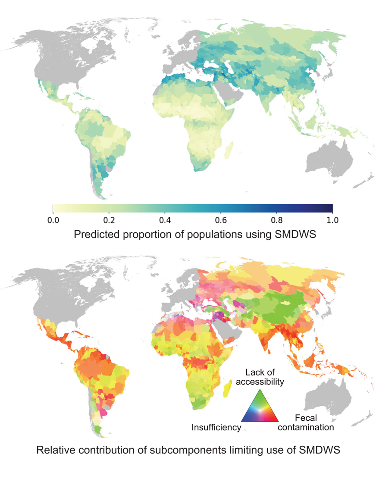

# Mapping safe drinking water use in low- and middle-income countries

Safe drinking water access is a human right, but data on safely managed drinking water services (SMDWS) is lacking for more than half of the global population. By combining existing household survey data, global Earth Observation datasets, and geospatial modelling, we estimate that only one in three people in low- and middle-income countries have access to SMDWS and identify fecal contamination as the primary limiting factor affecting almost half of the population of these regions. 
The study has been well received in the community and won the International Geneva Award 2024 for its high-quality and policy-relevance.

# Methods

*Fig. 1. Overview of data sources and data merging.*
*(A) SMDWS use and subcomponent estimates in 27 low- and middle-income countries were calculated at subnational district levels using 64,723 household survey responses from MICS data. (B) The outcome variable for the main model is the proportion of a district population using SMDWS. Subcomponent outcome variables are the proportion of a district population using a drinking water source which is (i) free of fecal contamination, (ii) accessible on premises, (iii) available when needed and (iv) improved. (C) Visual representation of geospatial predictors (67), which were merged with the outcome variables at subnational district levels and included human (n = 5), climate (n = 7), hydrogeologic (n = 7), biogeographic (n = 14), and topographic (n = 6) indicators derived from globally available geospatial datasets.*

# Results

*Fig. 2. Mapped SMDWS use.*
*Population percentage using SMDWS (above) and regions (below) where fecal contamination (red), lack of accessibility (green), and insufficiency (blue) of drinking water from a primary drinking water source are limiting the use of SMDWS. Both maps show the global administrative area level 1 in low- and middle-income countries.*

# Reproducibility

Here we explore environmental and anthropogenic covariates driving the spatial variation in safely managed drinking water services (SMDWS), and generate a global map of subnational (GADM version 3.6) estimates of SMDWs use across 135 low- and middle-income countries. Further, we determine the subcomponents limiting use of SMDWS around the world.

This repository includes "1_Data" as well as code for "2_Data_cleaning", "3_Feature_selection", "4_Training", and "5_Predictions" of SMDWs and its constituent subcomponents. We provide processed data derived from Earth Observation (EO) products in "1_Data/EnvironmentalFeatures" and share the code for the process we used in 2_Data_cleaning/1_SamplingEnvironmentalFeatures/ and 2_Data_cleaning/2_EO_matching_names_and_combining_files/ for users to understand how we preprocessed it in Google Earth Engine. If you use the EO data from the data frame we provide you need to cite the data sources which are listed in Data S2 of the Auxiliary Supplemental Material of the Paper "Mapping Safely Managed Drinking Water in Low and Middle Income Countries".

## Where to start?

Once you have cloned the repository from Github, we recommend you open the project "MICS_SMDW.Rproj" and run "renv::restore()" to make sure you have all the packages installed which are needed. If you are a reviewer or other person who has been given access to the combined and cleaned survey data frame "df_MICS_SMDW_250222.csv" on our swithchdrive folder we suggest you go straight to "4_Training" to run the main models. If you have not been given access to the survey data but would like to reproduce our results you will need to download the MICS household survey data from the website cited below and compile the training and test data set yourself.The code for this can be found in "2_Data_cleaning/MICS_Preprocessing_Dataframes/1_Compiling_MICS_test_and_training_sets".

## Information about data sets used in this study:

1)  MICS household (HH) datasets were downloaded from <https://mics.unicef.org/surveys> between 16.09.2019 and 02.02.2023 as they became available. If you download these files we suggest renaming them as hh_Countryname to be compatable with our code.

2)  UN Population Division Names

Country Names and codes extracted from World Population Prospects Demographic Indicator file from 2022 ("WPP2022_GEN_F01_DEMOGRAPHIC_INDICATORS_COMPACT_REV1.csv") downloaded from <https://population.un.org/wpp/Download/Standard/MostUsed/> on 13.03.2022

3)  Word Bank Country Income Groups

Downloaded on 10.02.2022 from <https://datahelpdesk.worldbank.org/knowledgebase/articles/906519-world-bank-country-and-lending-groups>

4)  JMP estimates for 2020

Downloaded from <https://washdata.org/data/downloads> on 11.07.2022.

5)  UNSD Methodology for Global Regions

Downloaded from <https://unstats.un.org/unsd/methodology/m49/overview/> on 14.07.2022

6) Worldwide Governance Indicators

Downloaded from <https://www.worldbank.org/en/publication/worldwide-governance-indicators> on 9.02.2024 
